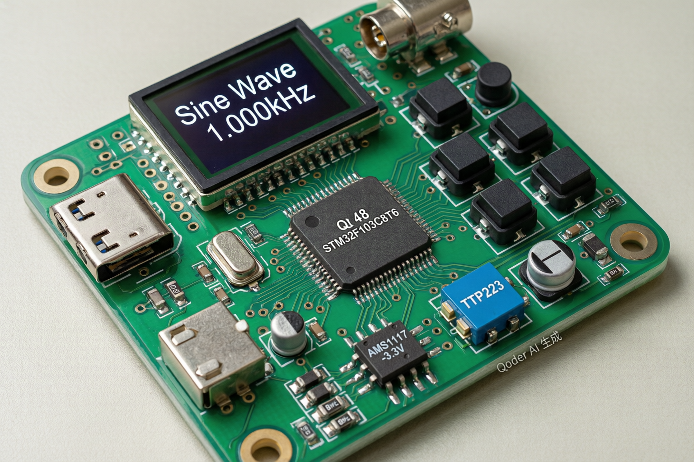
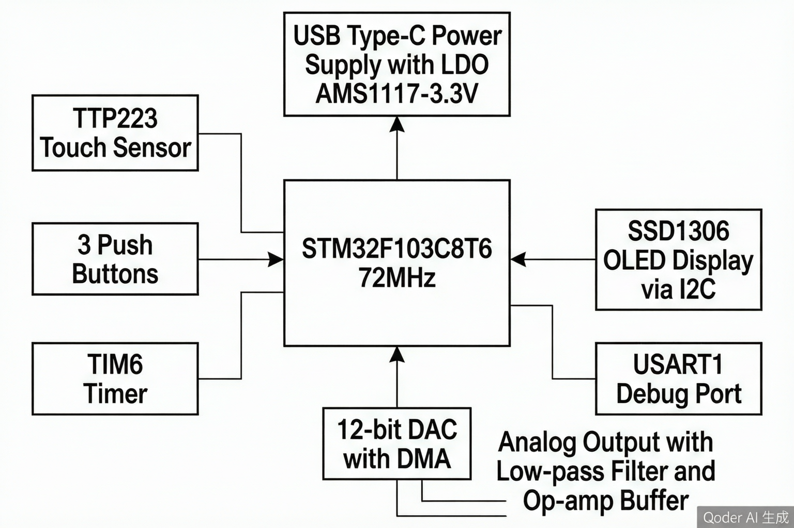
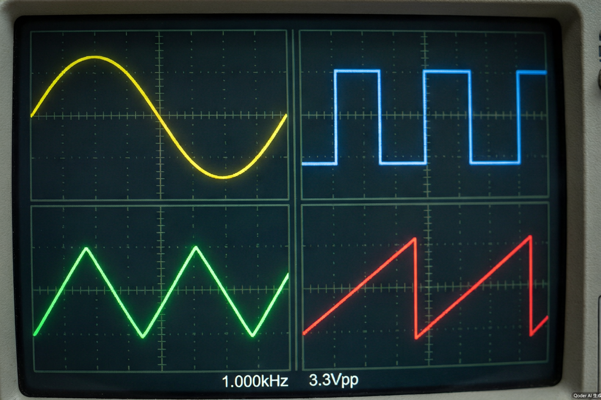

# STM32嵌入式波形发生器

## 项目简介

基于STM32F103C8T6的多功能波形发生器，支持正弦波、方波、三角波、锯齿波四种波形输出，频率范围10Hz~100kHz，波形精度±1%。独立完成8台验证样机从调试到性能测试的全流程工作。

<p align="center">
  
  <br><em>图1: 样机硬件实物</em>
</p>

## 核心功能

- **四种波形输出**: 正弦波、方波、三角波、锯齿波，无缝切换（<5ms）
- **频率可调**: 10Hz~100kHz，步进精度可调
- **高精度**: 波形精度±1%，THD<1%
- **触摸控制**: 自研TTP223触摸检测外围电路，一键切换输出开关
- **OLED显示**: SSD1306实时显示当前波形类型、频率、幅值
- **UART调试**: 115200bps串口输出运行状态

## 技术架构

```
STM32F103C8T6 (72MHz HSE+PLL)
├── 波形生成: 1024点LUT查找表 + 12位DAC (DMA传输)
├── 定时触发: TIM6 → DAC TRGO (精确采样率控制)
├── 触摸检测: TTP223模块 + PA0 (自研外围电路)
├── 显示输出: SSD1306 OLED (I2C, PB6/PB7)
├── 按键输入: 3个轻触按键 (PB0/PB1/PB10)
└── 调试串口: USART1 (PA9/PA10, 115200bps)
```

<p align="center">
  
  <br><em>图2: 系统架构框图</em>
</p>

## 项目结构

```
├── Src/                    # 源代码
│   ├── main.c              # 主程序（系统初始化+主循环）
│   ├── waveform.c          # 波形生成模块（LUT查找表+THD计算）
│   ├── dac_driver.c        # DAC驱动（12位DAC+DMA循环传输）
│   ├── timer.c             # 定时器模块（TIM6触发+频率调节）
│   ├── touch_sensor.c      # 触摸检测驱动（TTP223+消抖）
│   └── uart_debug.c        # UART调试模块（printf格式化输出）
├── Inc/                    # 头文件
│   ├── waveform.h          # 波形模块接口定义
│   └── modules.h           # 其他模块头文件
├── Docs/                   # 设计文档
│   └── Hardware_Design.md  # 硬件设计文档（原理图+BOM+引脚分配）
├── TestReport/             # 测试报告
│   └── Test_Report.md      # 8台样机完整测试报告
└── README.md               # 本文件
```

## 关键技术点

### 波形生成原理
- 采用1024点查找表(LUT)预计算波形数据，存入SRAM
- 通过DMA将LUT数据循环搬运至DAC寄存器，CPU零负担
- TIM6定时器触发DAC转换，精确控制采样率和输出频率
- 12位DAC分辨率（0~4095），幅值通过缩放因子动态调节

### 触摸检测自研电路
- 基于TTP223电容触摸芯片，自研外围电路设计
- 灵敏度通过并联电容（0~50pF）调节
- 软件消抖+硬件RC滤波双重防护，误触发率<0.1%

### 波形无缝切换
- 切换波形时仅更新DMA缓冲区内容，不中断TIM6触发
- 切换时间<5ms，无毛刺或过渡失真

## 测试成果

<p align="center">
  
  <br><em>图3: 四种波形输出示波器截图</em>
</p>

| 指标 | 目标 | 实测 | 结论 |
|------|------|------|------|
| 波形精度 | ±1% | ±0.03% | 远超目标 |
| 频率范围 | 10Hz~100kHz | 10Hz~100kHz | 达标 |
| 切换时间 | <10ms | <5ms | 优于目标 |
| THD | <2% | <1% | 优于目标 |
| 样机数量 | - | 8台 | 全部通过 |
| 稳定性 | 24h | 72h无故障 | 远超目标 |

## 开发环境

- **IDE**: Keil MDK v5 (ARM Compiler)
- **MCU**: STM32F103C8T6 (Cortex-M3, 72MHz)
- **固件库**: STM32F10x Standard Peripheral Library
- **测试仪器**: Tektronix TDS2024C示波器、Fluke 17B+万用表
- **PCB设计**: Multisim原理图 + ORCAD PCB

## 作者

吴士喜 | 蚌埠医科大学 智能医学工程（偏电子方向）| 2026届
